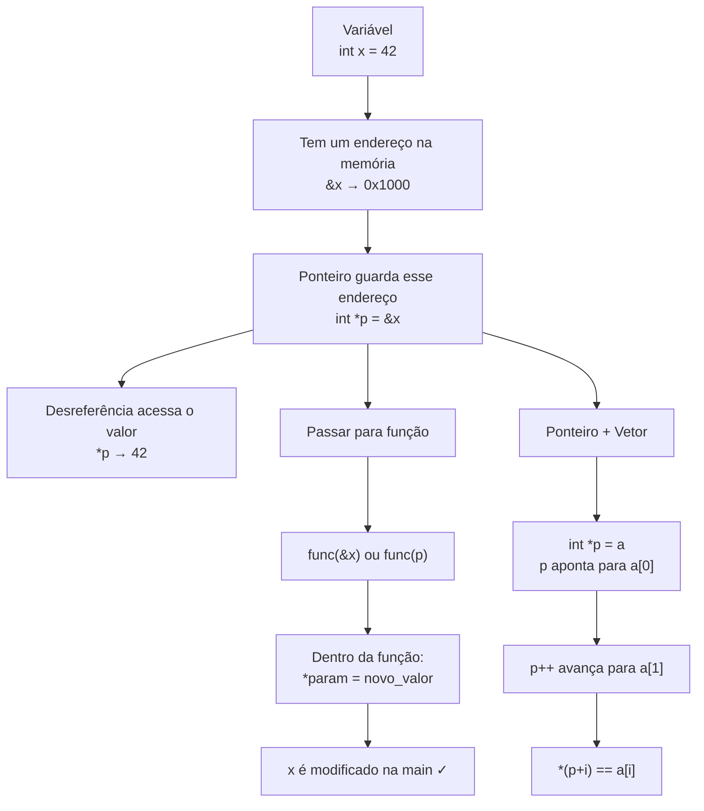

# 📌 Revisão Leve: Ponteiros em C

Uma revisão rápida e prática dos conceitos fundamentais de ponteiros, com base nos erros mais comuns encontrados nos exercícios da Lista 1.

---

## 1. O que é um Ponteiro?

Um ponteiro é uma **variável que guarda um endereço de memória** — ou seja, ele "aponta" para onde um valor está armazenado.

```c
int x = 42;
int *p = &x;  // p guarda o endereço de x
```

Visualizando na memória:

```text
Variável    Endereço     Valor
────────    ─────────    ──────
   x        0x1000        42
   p        0x1008       0x1000   ← p guarda o endereço de x
```

### Operadores Fundamentais

| Operador | Nome | O que faz | Exemplo |
|:--------:|:----:|:----------|:--------|
| `&` | **Endereço de** | Retorna o endereço de uma variável | `&x` → `0x1000` |
| `*` | **Desreferência** | Acessa o valor no endereço apontado | `*p` → `42` |

```c
int x = 42;
int *p = &x;

printf("%d\n", x);    // 42      (valor de x)
printf("%p\n", &x);   // 0x1000  (endereço de x)
printf("%p\n", p);    // 0x1000  (valor de p = endereço de x)
printf("%d\n", *p);   // 42      (valor no endereço que p aponta)
```

> [!TIP]
> Pense no `*` como "ir até o endereço e pegar/modificar o valor que está lá".

---

## 2. Declaração vs. Uso — O Duplo Papel do `*`

O asterisco (`*`) tem **dois significados diferentes** dependendo do contexto. Essa é uma fonte muito comum de confusão:

| Contexto | Significado | Exemplo |
|:---------|:------------|:--------|
| Na **declaração** | "Esta variável é um ponteiro" | `int *p;` |
| No **uso** | "Acesse o valor apontado" (desreferência) | `*p = 10;` |

```c
int x = 5;
int *p = &x;   // declaração: p é um ponteiro, inicializado com &x
*p = 10;        // uso: altera o valor no endereço que p aponta (x agora vale 10)
```

> [!CAUTION]
> `int *p = *b;` é um erro lógico! Você está declarando um ponteiro e atribuindo um **valor inteiro** a ele (o resultado de `*b`). Isso faz o ponteiro apontar para um endereço inválido.

---

## 3. Ponteiros e Funções — "Passagem por Referência"

Em C, argumentos são sempre passados **por cópia**. Para uma função modificar uma variável externa, ela precisa receber o **endereço** dessa variável.

### ❌ Não funciona (cópia local):
```c
void dobrar(int num) {
    num *= 2;  // modifica apenas a cópia local
}

int main() {
    int n = 21;
    dobrar(n);
    printf("%d\n", n);  // imprime 21 — n não mudou!
}
```

### ✅ Funciona (ponteiro):
```c
void dobrar(int *num) {
    *num *= 2;  // modifica o valor no endereço original
}

int main() {
    int n = 21;
    dobrar(&n);          // passa o endereço de n
    printf("%d\n", n);   // imprime 42 ✓
}
```

### Regra Prática para Parâmetros

Quando a assinatura de uma função pede `int *ptr`:

| Declare na `main` | Passe para a função |
|:-------------------|:--------------------|
| `int x;` (variável normal) | `funcao(&x)` (endereço) |

```c
// A função espera int* — o endereço de um int
void PercorreVetor(int *a, int n, int *min, int *max);

// Na main: declare int normais e passe &
int max, min;
PercorreVetor(p, tamanho, &min, &max);
```

> [!WARNING]
> **Não** declare `int *max = 0;` e passe `&max`. Isso cria um `int **` (ponteiro para ponteiro) e causa incompatibilidade de tipos. Pior: `int *max = 0` é um ponteiro NULL — desreferenciá-lo causa **Segmentation Fault**.

---

## 4. Ponteiros e Vetores (Arrays)

Em C, o nome de um vetor **já é um ponteiro** para seu primeiro elemento:

```c
int a[] = {10, 20, 30, 40, 50};
int *p = a;       // equivalente a: int *p = &a[0];
```

```text
Índice:     [0]    [1]    [2]    [3]    [4]
Valor:       10     20     30     40     50
Endereço: 0x100  0x104  0x108  0x10C  0x110
              ↑
              p (e também 'a')
```

### Aritmética de Ponteiros

Somar `1` a um ponteiro avança para o **próximo elemento** (não o próximo byte):

```c
int a[] = {10, 20, 30};
int *p = a;

printf("%d\n", *p);       // 10  (a[0])
printf("%d\n", *(p + 1)); // 20  (a[1])
printf("%d\n", *(p + 2)); // 30  (a[2])
```

### Equivalência entre notações

Essas formas são **equivalentes**:

```c
a[i]  ⟺  *(a + i)  ⟺  *(p + i)  ⟺  p[i]
```

### Avançando o Ponteiro

| Código | Efeito |
|:-------|:-------|
| `p + 1` | Calcula o próximo endereço, mas **não altera** `p` |
| `p++` ou `p = p + 1` | **Avança** `p` para o próximo elemento |

> [!CAUTION]
> `p + 1;` sozinho em uma linha é uma **expressão sem efeito** — o compilador até avisa! Use `p++` para realmente mover o ponteiro.

---

## 5. Variáveis Não Inicializadas — Lixo de Memória

Em C, variáveis locais **não** são zeradas automaticamente. Elas contêm o que estiver na memória ("lixo"):

### ❌ Lixo de memória:
```c
int soma;        // pode conter qualquer valor (ex: 1981451027)
soma += a[i];    // soma lixo + valor = resultado errado
```

### ✅ Inicializando corretamente:
```c
int soma = 0;    // começa do zero
soma += a[i];    // agora funciona como esperado
```

> [!IMPORTANT]
> **Sempre inicialize** variáveis locais antes de usá-las, especialmente acumuladores, contadores e ponteiros.

---

## 6. Resumo Visual — Mapa Mental



---

## 7. Checklist de Erros Comuns

Use esta checklist ao revisar seu código com ponteiros:

- [ ] Inicializei todas as variáveis locais antes de usá-las? (`int soma = 0;`)
- [ ] Estou declarando `int x` (normal) e passando `&x` para funções que pedem `int *`?
- [ ] Estou usando `p++` (e não `p + 1;`) para avançar o ponteiro?
- [ ] Estou desreferenciando (`*p`) ao querer o **valor**, e não o endereço?
- [ ] Estou usando `printf` (e não `print`)?
- [ ] No `printf`, estou usando `%d` com `int` e `%p` com ponteiros?
- [ ] Na função de swap, estou salvando `*a` em `aux` **antes** de sobrescrever?

---

> *Documento gerado com base nos exercícios da Lista 1 — ED1 (2026.1)*
