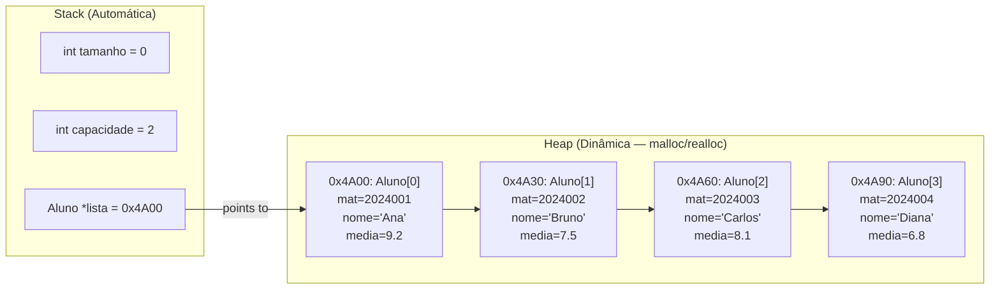

# 📦 Overview: Struct, Malloc, Realloc & Free in C

A practical guide to dynamic memory and data structures in C, with examples based on your `Aluno` struct.

---

## 1. Structs — Grouping Data Together

A `struct` lets you bundle multiple variables of different types into a single unit.

### Declaration & Typedef

```c
// Without typedef — verbose
struct Aluno {
    int matricula;
    char nome[32];
    float media;
};
struct Aluno a1;  // must write "struct Aluno" every time

// With typedef — clean
typedef struct {
    int matricula;
    char nome[32];
    float media;
} Aluno;
Aluno a1;  // just "Aluno" ✓
```

> [!TIP]
> Always use `typedef` for cleaner code. It's the standard practice in data structures courses.

### Accessing Fields

| Syntax | When to use | Example |
|:------:|:------------|:--------|
| `.`    | Variable is a **struct** | `a1.media = 9.5;` |
| `->`   | Variable is a **pointer to struct** | `p->media = 9.5;` |

```c
Aluno a1;
a1.matricula = 2024001;       // direct access with .

Aluno *p = &a1;
p->matricula = 2024001;       // pointer access with ->
// p->field is shorthand for (*p).field
```

### Arrays of Structs (Static)

```c
Aluno turma[30];              // array of 30 students on the stack
turma[0].matricula = 2024001;
turma[0].media = 8.7;
```

> [!NOTE]
> Static arrays have a **fixed size** defined at compile time. For resizable collections, you need dynamic allocation — that's where `malloc` comes in.

---

## 2. Malloc — Allocating Memory at Runtime

`malloc` (**m**emory **alloc**ation) requests a block of memory from the **heap** at runtime.

```c
#include <stdlib.h>  // required for malloc, realloc, free

void *malloc(size_t size);
// Returns: pointer to allocated block, or NULL on failure
```

### Basic Usage

```c
// Allocate memory for a single Aluno
Aluno *aluno = (Aluno *) malloc(sizeof(Aluno));

// Allocate memory for an array of 5 Alunos
Aluno *turma = (Aluno *) malloc(5 * sizeof(Aluno));
```

Breaking it down:

```text
Aluno *turma = (Aluno *) malloc(5 * sizeof(Aluno));
  │               │               │        │
  │               │               │        └─ size of one Aluno in bytes
  │               │               └─ number of elements
  │               └─ cast void* to Aluno*
  └─ pointer that will hold the address of the allocated block
```

### Always Check for NULL

`malloc` returns `NULL` if there isn't enough memory available:

```c
Aluno *turma = (Aluno *) malloc(5 * sizeof(Aluno));
if (turma == NULL) {
    printf("Error: memory allocation failed!\n");
    return 1;
}
// Safe to use turma from here
```

> [!WARNING]
> Dereferencing a `NULL` pointer causes a **Segmentation Fault** — always check before using the pointer.

### Using the Allocated Memory

Once allocated, use it just like an array:

```c
Aluno *turma = (Aluno *) malloc(3 * sizeof(Aluno));

// Access with array notation
turma[0].matricula = 2024001;
turma[0].media = 9.2;

// Or with pointer arithmetic
(turma + 1)->matricula = 2024002;
(turma + 1)->media = 7.8;

// Both are equivalent:
// turma[i].field  ⟺  (turma + i)->field
```

### Stack vs. Heap

| Feature | Stack | Heap |
|:--------|:------|:-----|
| Allocation | Automatic (`int x;`) | Manual (`malloc`) |
| Deallocation | Automatic (end of scope) | Manual (`free`) |
| Size | Fixed at compile time | Flexible at runtime |
| Speed | Faster | Slower |
| Risk | Stack overflow (large data) | Memory leaks (forgot to `free`) |

---

## 3. Realloc — Resizing Allocated Memory

`realloc` (**re**-**alloc**ation) changes the size of a previously allocated block.

```c
void *realloc(void *ptr, size_t new_size);
// Returns: pointer to resized block (may be a NEW address), or NULL on failure
```

### Basic Usage

```c
// Start with space for 3 students
Aluno *turma = (Aluno *) malloc(3 * sizeof(Aluno));

// Later, need space for 6 students
turma = (Aluno *) realloc(turma, 6 * sizeof(Aluno));
```

### What Realloc Does Internally

```text
Case 1: Enough space to expand in place
┌───┬───┬───┬───┬───┬───┐
│ 0 │ 1 │ 2 │ 3 │ 4 │ 5 │  ← expanded, same address
└───┴───┴───┴───┴───┴───┘

Case 2: Not enough space — allocates new block, copies data, frees old block
OLD:  ┌───┬───┬───┐
      │ 0 │ 1 │ 2 │ ← freed automatically
      └───┴───┴───┘
NEW:  ┌───┬───┬───┬───┬───┬───┐
      │ 0 │ 1 │ 2 │ 3 │ 4 │ 5 │  ← new address, data copied
      └───┴───┴───┴───┴───┴───┘
```

> [!IMPORTANT]
> `realloc` may return a **different address** than the original. Always assign the result back to your pointer.

### Safe Realloc Pattern

There's a subtle danger: if `realloc` fails, it returns `NULL` but **does not free** the original block. If you write `turma = realloc(turma, ...)` and it fails, you lose the pointer to the original memory (memory leak!).

The safe pattern uses a temporary pointer:

```c
Aluno *temp = (Aluno *) realloc(turma, new_size * sizeof(Aluno));
if (temp == NULL) {
    printf("Error: realloc failed!\n");
    free(turma);  // free the original block
    return 1;
}
turma = temp;  // only update if successful
```

### Special Cases

```c
realloc(NULL, size);   // behaves like malloc(size)
realloc(ptr, 0);       // behaves like free(ptr)  [implementation-defined]
```

---

## 4. Free — Releasing Memory

`free` returns allocated memory back to the system:

```c
void free(void *ptr);
```

### Basic Usage

```c
Aluno *turma = (Aluno *) malloc(5 * sizeof(Aluno));
// ... use turma ...
free(turma);       // release the memory
turma = NULL;      // good practice: avoid dangling pointer
```

### Rules of Free

| Rule | Why |
|:-----|:----|
| Only `free` what was `malloc`'d/`realloc`'d | Freeing stack memory = crash |
| Don't `free` the same pointer twice | Double free = undefined behavior / crash |
| Don't use memory after `free` | Dangling pointer = garbage or crash |
| Set pointer to `NULL` after `free` | Prevents accidental use |

### Memory Leak — Forgetting to Free

```c
void leaky_function() {
    Aluno *p = (Aluno *) malloc(sizeof(Aluno));
    p->matricula = 1234;
    // function ends without free(p)
    // the memory is LOST — no pointer to it anymore!
}
```

Each call to `leaky_function` leaks `sizeof(Aluno)` bytes. Over time (especially in loops), this can exhaust all available memory.

> [!CAUTION]
> **Every `malloc` must have a matching `free`.** Think of them as open/close brackets — always in pairs.

---

## 5. Putting It All Together — Dynamic Student List

Here's a complete example that uses all four concepts to build a resizable student list:

```c
#include <stdio.h>
#include <stdlib.h>
#include <string.h>

typedef struct {
    int matricula;
    char nome[32];
    float media;
} Aluno;

// Adds a student to the dynamic array, resizing as needed
Aluno *adicionarAluno(Aluno *lista, int *tamanho, int *capacidade,
                       int mat, const char *nome, float media) {
    // If array is full, double the capacity
    if (*tamanho >= *capacidade) {
        *capacidade *= 2;
        Aluno *temp = (Aluno *) realloc(lista, *capacidade * sizeof(Aluno));
        if (temp == NULL) {
            printf("Erro: falha no realloc!\n");
            free(lista);
            return NULL;
        }
        lista = temp;
    }

    // Add the new student
    lista[*tamanho].matricula = mat;
    strncpy(lista[*tamanho].nome, nome, 31);
    lista[*tamanho].nome[31] = '\0';
    lista[*tamanho].media = media;
    (*tamanho)++;

    return lista;
}

void imprimirLista(Aluno *lista, int tamanho) {
    printf("\n--- Lista de Alunos ---\n");
    for (int i = 0; i < tamanho; i++) {
        printf("[%d] %s - Media: %.1f\n",
               lista[i].matricula, lista[i].nome, lista[i].media);
    }
}

int main(void) {
    int tamanho = 0;      // current number of students
    int capacidade = 2;   // initial capacity

    // malloc: allocate initial space for 2 students
    Aluno *lista = (Aluno *) malloc(capacidade * sizeof(Aluno));
    if (lista == NULL) {
        printf("Erro: falha no malloc!\n");
        return 1;
    }

    // Add students (realloc happens automatically when full)
    lista = adicionarAluno(lista, &tamanho, &capacidade,
                           2024001, "Ana", 9.2);
    lista = adicionarAluno(lista, &tamanho, &capacidade,
                           2024002, "Bruno", 7.5);
    lista = adicionarAluno(lista, &tamanho, &capacidade,
                           2024003, "Carlos", 8.1);  // triggers realloc!
    lista = adicionarAluno(lista, &tamanho, &capacidade,
                           2024004, "Diana", 6.8);

    imprimirLista(lista, tamanho);

    // free: release all memory
    free(lista);
    lista = NULL;

    return 0;
}
```

**Output:**
```text
--- Lista de Alunos ---
[2024001] Ana - Media: 9.2
[2024002] Bruno - Media: 7.5
[2024003] Carlos - Media: 8.1
[2024004] Diana - Media: 6.8
```

---

## 6. Memory Layout — Visual Overview



---

## 7. Quick Reference

| Function | Header | Purpose | Returns |
|:---------|:-------|:--------|:--------|
| `malloc(size)` | `<stdlib.h>` | Allocate `size` bytes | Pointer or `NULL` |
| `realloc(ptr, size)` | `<stdlib.h>` | Resize block to `size` bytes | Pointer or `NULL` |
| `free(ptr)` | `<stdlib.h>` | Release allocated memory | Nothing |
| `sizeof(Type)` | Built-in | Size of a type in bytes | `size_t` |

---

## 8. Common Mistakes Checklist

- [ ] Did I `#include <stdlib.h>`?
- [ ] Did I check if `malloc` / `realloc` returned `NULL`?
- [ ] Am I using `sizeof(Aluno)` (not a hardcoded byte count)?
- [ ] Am I using `->` with pointers and `.` with variables?
- [ ] Does every `malloc` have a matching `free`?
- [ ] Did I set the pointer to `NULL` after `free`?
- [ ] Am I using the safe `realloc` pattern (temp pointer)?
- [ ] Am I **not** using memory after calling `free`?
- [ ] Am I **not** freeing the same pointer twice?

---

> *Document generated for ED1 — Lista 2 (2026.1)*
